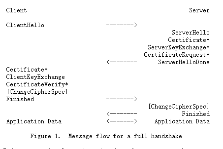

## 简介

[HTTP](https://zh.wikipedia.org/wiki/HTTP)的[URL](https://zh.wikipedia.org/wiki/统一资源定位符)是由“`http://`”起始与默认使用[端口](https://zh.wikipedia.org/wiki/TCP/UDP端口列表)80，而HTTPS的URL则是由“`https://`”起始与默认使用[端口](https://zh.wikipedia.org/wiki/TCP/UDP端口列表)443。

由于HTTP使用明文传输，攻击者可以通过[监听](https://zh.wikipedia.org/wiki/監聽)和[中间人攻击](https://zh.wikipedia.org/wiki/中间人攻击)等手段，获取网站帐户和敏感信息等，因此是不安全的。HTTPS的设计可以防止前述攻击。

HTTPS工作在HTTP之下，传输层之上：它向运行HTTP的进程提供一个类似于TCP的套接字，供进程向其中注入报文，然后将报文加密并注入运输层套接字；或是从运输层获取加密报文，解密后交给对应的进程。严格地讲，HTTPS并不是一个单独的协议，而是对工作在一加密连接（[TLS](https://zh.wikipedia.org/wiki/传输层安全)或SSL）上的常规HTTP协议的称呼。

HTTPS报文中的任何东西都被加密，包括所有报头和荷载。

## 内容

### TSL

握手步骤如下：

### SSL

## 参考资料

[TSL - V1.2](https://tools.ietf.org/html/rfc5246)

[SSL - V3.0](https://tools.ietf.org/html/draft-ietf-tls-ssl-version3-00)

[超文本安全协议 - 维基百科](https://zh.wikipedia.org/wiki/%E8%B6%85%E6%96%87%E6%9C%AC%E4%BC%A0%E8%BE%93%E5%AE%89%E5%85%A8%E5%8D%8F%E8%AE%AE)

